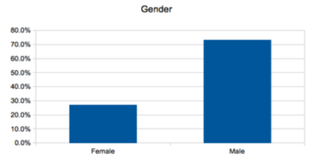

% Software Carpentry - Overview
  Spelman College
% Software Carpentry Team
% June 2014 

## Copy This Lecture!
  
  
  
  
  
  
 Software Carpentry Overview by <a xmlns:cc="http://creativecommons.org/ns#" href="http://software-carpentry.net" property="cc:attributionName" rel="cc:attributionURL">Software Carpentry</a> is licensed under a <a rel="license" href="http://creativecommons.org/licenses/by/3.0/deed.en_US">Creative Commons Attribution 3.0 Unported License</a>.

# More About Software Carpentry

## History

* Founded by Greg Wilson in 1998, teaching scientists how to use supercomputers at LANL.
* Open sourced materials 2004-present
* Currently funded by the Sloan Foundation and the Mozilla Foundation
* This workshop thanks to NSF

## What We Teach

* Unix Command Line Interface (Shell)
* Shell automation 
* Version Control (using git)
* Python
* Testing

## What We *Actually* Teach

* A program is just another piece of lab equipment
* Human resources are the precious ones--write programs for humans
* Don't repeat yourself, let the computer repeat it
* Paranoia makes us productive
* Better algorithms beat better hardware

## Who We Teach

<table>
<tr>
<td></td>
<td></td>
</tr>
<tr>
<td></td>
<td></td>
</tr>
</table>

## Who We Are

* Will Trimble (Argonne National Laboratory)
* Elijah Lowe (Michigan State University)
* volunteers
 
## Our Goals for You

* If you've ever overwritten the wrong file, we'll show you how to use version control.
* If you've ever spent hours typing the same commands over and over again, we'll show you how to automate those tasks using simple scripts.
* If you've ever spent an afternoon trying to figure out what the program you wrote last week actually does, we'll show you how to break your code into modules that you can read, debug, and improve piece by piece.

## Some High-Level Advice

* You will learn faster by observing and working with others who are more
skilled than you ( than by working alone )
* http://www.plosbiology.org/article/info%3Adoi%2F10.1371%2Fjournal.pbio.1001745 "Best practices for scientific computing" paper in PLOS Biology

## Make it work right first, make it fast later.
* "Premature optimization is the root of all evil." -- Donald Knuth
* Directing your attention to making it use less disk / less memory /
less time from the start is wrongly directed attention.

## Increase debugging bandwidth

* The sooner you can get feedback as to whether it's working, the faster you can move forward. 
* Development environments and debuggers give you more information at once 
* Test the parts first, not the whole; fail early, fail often! 
* Test your workflow on subsets of your data **so that you learn whether
it works faster**

## Warning signs
* If you find yourself typing the same commands again and again
* If you repeat the same block of code with cut-and-paste more than once
* If any piece of code is too complex to easily describe, consider refactoring it
* If you find yourself writing code the same script over and over

## Don't repeat yourself 
* **Don't repeat commands into your REPL, save them to a script**
* Refactor commonly used blocks of code into **functions**
* Group commonly used functions into **libraries**
* Openly licensed non-commercial libraries tend to have a much longer effective lifespan than unreleased codes*
* **Share your code with others, and use their code**
* Back up everything important in proportion to its replacement value.

## Document your computational work
* Save **every bit of code** you use for generating publishable results
* Save the scripts that get and process the data
* Document and comment your code for yourself as if you will need to understand
it in 6 months

## You sometimes need geeks.  You never need dorks.

<table>
<tr>
<td></td>
</tr>
</table>

## That's all Folks

## Programming Languages for Scientific Computing
Matthew G. Knepley

Preprint: http://arxiv.org/pdf/1209.1711.pdf

*Gives an overview of modern programming languages and techniques such as code
generation, templates, and mixed-language designs. This is a preprint,
so expect some rough spots.*

## Two Solitudes
Greg Wilson

Slides: http://www.slideshare.net/gvwilson/two-solitudes

*Describes Greg's journey as a scientist and leader for the Software Carpentry
project, provides some insight into the differences between industry and
academics.*

## Best Practices for Scientific Computing
D. A. Aruliah, C. Titus Brown, Neil P. Chue Hong, Matt Davis, Richard T. Guy,
Steven H. D. Haddock, Katy Huff, Ian Mitchell, Mark Plumbley, Ben Waugh,
Ethan P. White, Greg Wilson, Paul Wilson

Preprint: http://arxiv.org/abs/1210.0530

*Good summary paper of many fundamental practices for working with and
developing scientific software. This is a preprint, so expect some rough spots.*

# Web References

## What Every Computer Scientist Should Know About Floating-Point Arithmetic
David Golberg

Web article: http://docs.oracle.com/cd/E19957-01/806-3568/ncg_goldberg.html

*Introduction to the IEEE floating-point standard, its implications, and many of
the common pitfalls when using floating-point numbers in scientific computing*

## Science Code Manifesto

http://sciencecodemanifesto.org

*Publicly signed commitment to clear licensing and curation of software
associated with research publications.*

